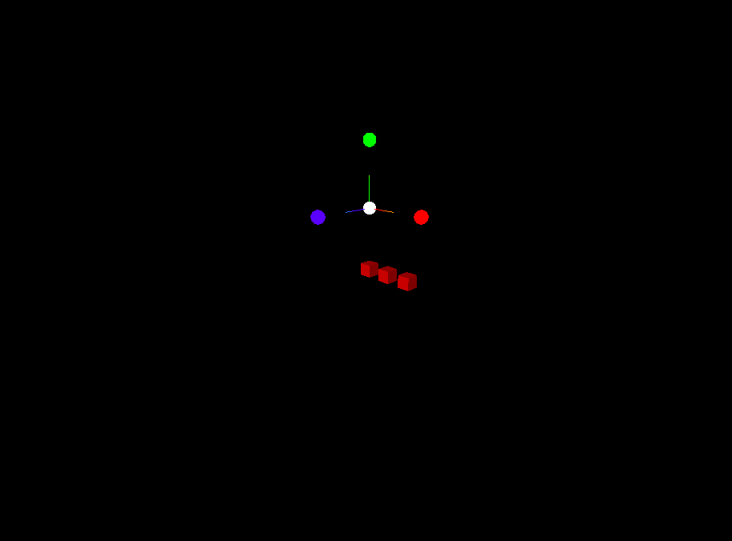
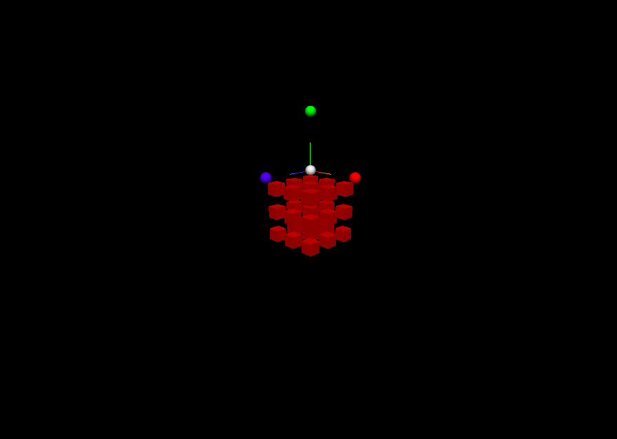
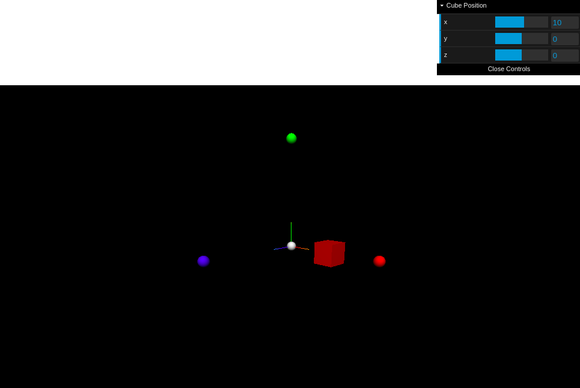
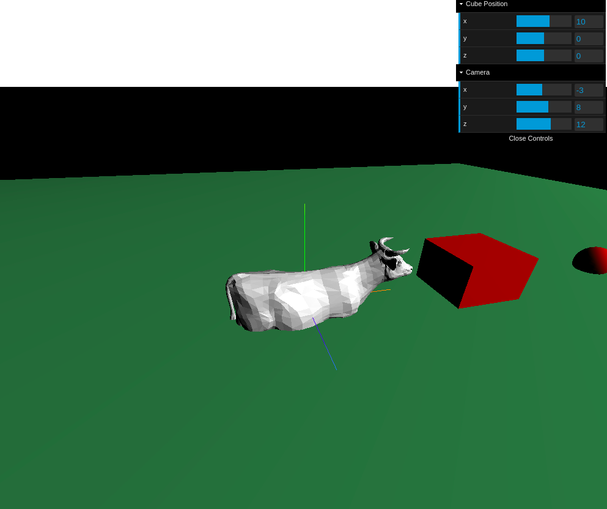
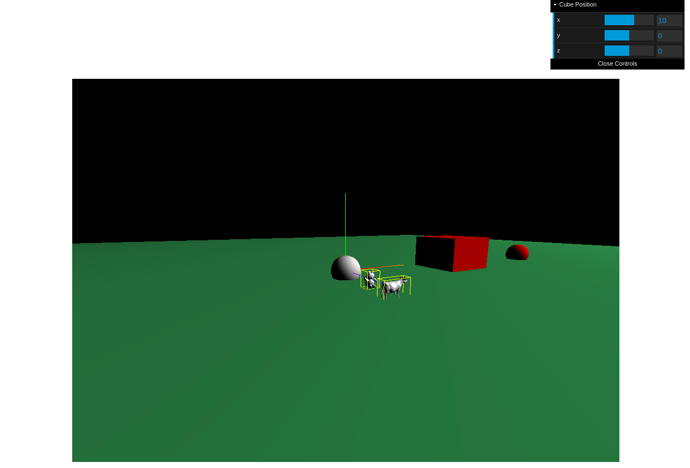
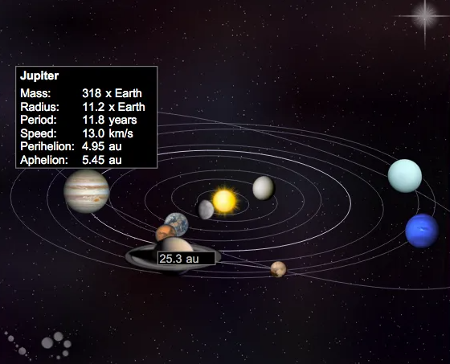

Kellian GOFFIC                                                                                                          12/02/2021

# Rapport 012

## P4x - Synthèse d'images

#### TP1

---

###### Prise en main de ThreeJS : Génération et modèle Lambertien

Prise en main de la génération d'objets et leur affichage pour les 4 sphères sur les différents axes du repère ainsi qu'à l'origine.

Ajout de 3 cubes avec un `MeshLambertMaterial`, ainsi qu'une source de lumière `SpotLight`.

Si le fond est noir, il est impossible de voir les mesh's du type `MeshLambertMaterial` sans source lumineuse, car ceux-ci apparaissent noir. (*logique*)

Génération dynamique d'un ensemble de cube, qui devait être au départ un Rubik's Cube.

###### Affichage et utilisation d'une interface :

Quelques galères pour créer et ajouter une interface `dat-gui` . Après quelques cheveux arrachés voilà le resultat obtenu qui permet de déplacer le cube dans la scène.

C'était pas si compliqué au final...

#### TP2

---

###### Import de maillages : OBJLoader

La classe OBJLoader permet d'importer un fichier `*.obj` et le convertit en maillage afin de pouvoir s'en servir et les ajouter à la scène notamment.

On peut noter que je me suis un peu embêter à ajouter un dossier caméra au GUI afin de la déplacer, avant de me rendre compte que la fin du TP1 faisait référence à la classe `OrbitControls` pour contrôler la caméra à l'aide de la souris...

Lors de l'importation *brute* des objets, on obtient une grosse vache, un nounours géant et un lapin de pâques en chocolat.

Il est donc nécessaire de calculer le coefficient de mise à l'échelle pour obtenir un objet de la hauteur souhaitée. On obtient donc ceci :

On remarque pas bien sur la capture d'écran mais les objets ne sont pas forcément sur le sol. (Sur la capture ils le sont, mais le sol est en `y = -1`.)

Il faudrait donc trouver un moyen d'appliquer une translation afin de les aligner avec le sol. Mais ce sera sans résultat pour moi.

Je suppose fortement que le problème vient de *l'emplacement* du *point de repère* de l'objet : sur certains objets il est au centre, d'autres en bas à gauche...

Lorsqu'on choisi la position de l'objet, on chosit la position de ce repère et l'objet se place par rapport à lui, on a donc un décalage entre les objets en fonction de où est situé celui-ci. A part modifier les valeurs à la main pour aligner les objets à la main, je n'ai pas réussi à trouver une formule correcte ni fonctionnelle pour translater verticalement les objets.

###### Projet

---

Pour le moment je vois beaucoup de créations très chouettes de la part de mes camarades (coucou Pierre E.).

Je sais pas trop quoi faire mais j'ai eu l'idée de reproduire le système solaire : position des planètes (satellites aussi peut-être?), textures de celles-ci, périodes de révolution...

