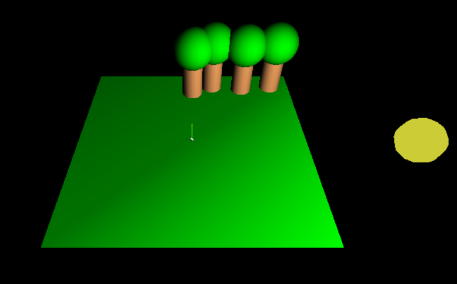
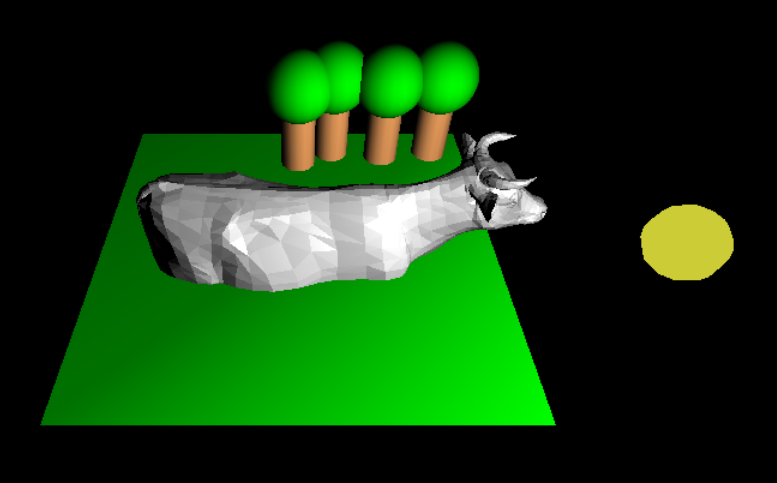
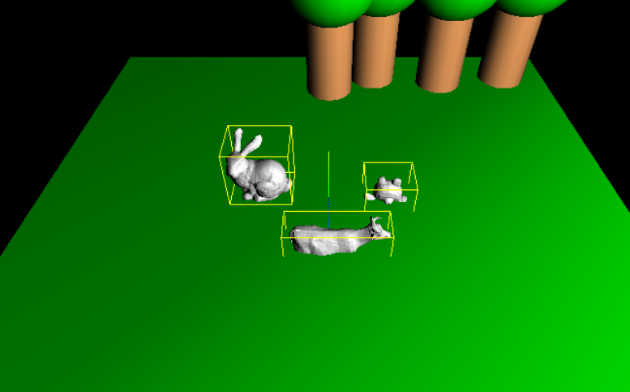
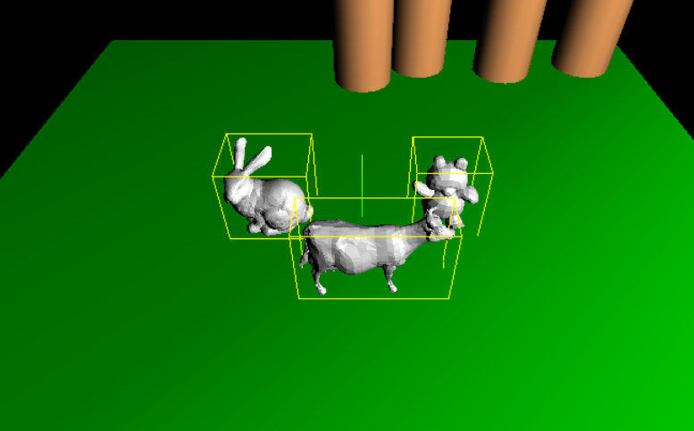
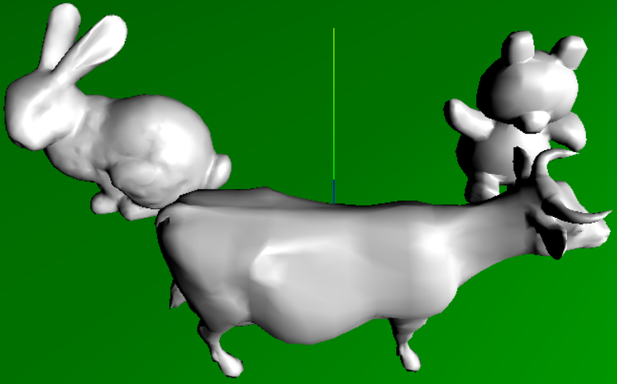
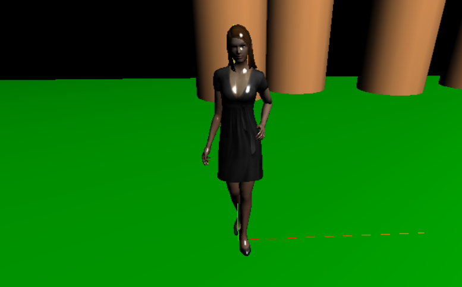

# Manipulation de maillages

Lors du TP précédent, nous avons découvert comment créer une scène 3D avec Three.js et ajouté des objets basiques. 
Dans ce TP, nous allons travailler avec des objets plus complexes.

Le travail se fera en 2 étapes : charger des données, puis les manipuler.

## Import de maillages

Définition : dans un programme informatique, *importer* consiste à lire des données, généralement stockées dans un fichier, dans un format non utilisable tel quel par le-dit programme, et les convertir de sorte que le programme puisse les comprendre et les manipuler.

- Utiliser la classe OBJLoader (bibliothèque OBJLoader.js fournie) 
pour créer un Mesh dont la géométrie est décrite dans un fichier OBJ et l'ajouter à la scène.
Quelques fichiers OBJ sont fournis à titre d'exemples.

N'hésitez pas à les ouvrir avec un éditeur de texte pour en comprendre le contenu.

Pour la syntaxe, les instructions se trouvent dans la [documentation](https://threejs.org/docs/#examples/en/loaders/OBJLoader).

- Vérifier que les données sont bien importées. Vous serez peut-être confrontés à un problème de sécurité décrit [ici](https://threejs.org/docs/index.html#manual/en/introduction/How-to-run-things-locally). C'est ici que le serveur HTTP local peut solutionner ce problème.

- Essayer d'importer différents objets. Que constate-t-on ?
  Ils s'importent mais sont moches.

- (Optionnel) Afficher la boîte englobante de l'objet à l'aide de la classe [BoxHelper](https://threejs.org/docs/#api/en/helpers/BoxHelper)
 
- Calculer le coefficient de mise à l'échelle pour obtenir un objet de hauteur d'une unité (= 1 mètre). Appliquer ce coefficient à l'objet pour l'intégrer au décor
  Difficile de trouver des informations dessus. Beaucoup d'essais
et de recherche avant de comprendre que l'object de l'OBJLoader est 
un group d'object.

- Essayer d'importer différents objets. Que constate-t-on ?
 

 
- Maintenant que tous les objets ont une hauteur standard, calculer la translation verticale pour que l'objet soit positionné à la hauteur du sol. Appliquer la translation verticale.

- Refactorer maintenant le code pour en faire une fonction qui prenne en paramètre le nom du fichier et la hauteur cible pour importer autant d'objets que voulus et spécifier la taille cible.

- Ajouter, si ce n'est pas encore fait, des paramètres à votre fonction d'import pour spécifier la taille de l'objet et sa position. Eventuellement aussi sa rotation (orientation).

- Agrémenter la scène de décors du TP1 avec des objets divers issus de fichiers .obj. On pourra trouver de tels fichiers sur internet ( par exemple https://en.wikipedia.org/wiki/List_of_common_3D_test_models , https://casual-effects.com/data/ )

## Pour aller plus loin

Les questions suivantes sont optionnelles, pour ceux qui sont en avance ou ont envie d'approfondir certains points.

### Lissage (**smoothing**)
- On constate que les objets fournis avec le TP ne sont pas lisses. Trouver une méthode pour lisser les objets. 

#### Indications
- Il faudra calculer les normales aux sommets (voir propos du cours)
- OBJLoader.js charge les modèles directement dans la mémoire du GPU. Il faudra faire une gymnastique pour ces manipuler ces objets depuis le CPU. (cf. [BufferAttribute](https://threejs.org/docs/#api/en/core/BufferAttribute) indiqué dans [BufferGeometry](https://threejs.org/docs/#api/en/core/BufferGeometry) )

### Chargement de textures
Les objets ainsi importés n'ont ni couleurs ni textures. Or on peut voir que les objets proposés dans les bibliothèques en ligne disposent de textures et de couleurs.

- Sur le même principe que pour l'OBJLoader, utiliser la classe [MTLLoader](https://threejs.org/docs/#examples/en/loaders/MTLLoader) (bibliothèque MTLLoader.js fournie) pour importer un mesh et ses textures et l'ajouter à la scène.

#### Indications
- le fait que les ressources (maillages et textures) se trouvent généralement dans des fichiers séparés, vous serez confrontés à des problèmes de chemin d'accès
- il se peut que des fichiers MTL trouvés sur internet soient mal formés. N'hésitez pas à les ouvrir avec un éditeur de texte pour en comprendre le contenu.

## Notes

N'oubliez pas que three.js offre des classes dites [*helper*](http://threejs.org/examples/#webgl_helpers) pour vous aider au cours de vos développements !
