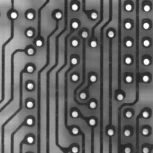
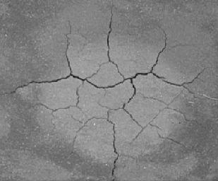

## Morphologie mathématique

On se place dans le cadre de la morphologie des images en niveaux de gris, et on considère un  *élément structurant plat* B (B est l'ensemble caractéristique des points de l'élément structurant, appelé *support*).

L'*érosion* d'une image I par B est donnée au point $`(x,y)`$ par :
```math
\varepsilon_B(I)(x,y)=\min \{I(x+i,y+j) \mid (i,j) \in B\},
```
et la *dilatation* d'une image I par B est donnée au point $`(x,y)`$ par :
```math
\delta_B(I)(x,y)=\max \{I(x-i,y-j) \mid (i,j) \in B\}.
```
(noter le $`-`$ dans la définition de la dilatation).

On note $`\omega_B`$ et $`\phi_B`$, respectivement, les opérateurs d'*ouverture* et de *fermeture* par l'élément structurant B.

Le  *gradient morphologique* est défini au point $`(x,y)`$ par
```math
\gamma(I)(x,y)=\delta_D(I)(x,y)-\varepsilon_D(I)(x,y),
``` 
où  D est le disque unité fermé (une définition explicite, dans le cas discret, en est donnée dans la section suivante).

### Travail à réaliser

L'objectif est d'implanter les opérateurs ci-dessus.

#### Élément structurant 

Il est nécessaire de définir une structure de données pour coder un élément structurant.
Un élément structurant est défini par :
- l'ensemble des points p de son *support* ;
- les coordonnées de l'origine.

Il serait possible de coder un élément structurant en utilisant une image (ou un tableau 2D), en associant à chaque pixel de l'image une valeur décrivant l'appartenance ou non de ce point au support de l'élément structurant et en fixant une origine arbitrairement (par exemple le centre de l'image).
C'est en fait peu efficace en terme de mémoire. Par exemple stocker l'élément structurant composé de deux points de valeur 0 aux coordonnées p(1000,1000) et q(-1000,-1000) nécessite de créer une image de taille $`(1000+1+1000,1000+1+1000)`$ (la taille du carré englobant ces deux points).

Une structure de données plus optimale en terme de mémoire consiste à coder l'ensemble des points du support de l'élément structurant en donnant leur position par rapport à l'origine (fixée aux coordonnées $`(0,0)`$).

#### Exemple

Considérons l'élément structurant $`B_1`$ défini par le disque fermé de rayon 1 (en utilisant la 4-adjacence). Celui-ci peut être codé de la manière suivante :

```math
\begin{array}{ccc}
 & \bullet &  \\
\bullet & \bullet &  \bullet \\
 &  \bullet &  \\
\end{array}
\quad\text{ ou, sous forme de coordonnées :}\quad
\begin{array}{ccc}
 & (0,-1) &  \\
(-1,0) & (0,0) & (1,0) \\
 & (0,1) &  \\
\end{array}
```
(Les disques pleins symbolisent les points appartenant à l'élément structurant,  y compris, ici, l'origine).

- Créer une classe *Structel* permettant de coder un élément structurant.
La classe permettra  de stocker l'ensemble des points  de l'élément structurant relativement à l'origine $`(0,0)`$.
L'ensemble des points pourra être codé dans un tableau dont l'ordre est sans importance puisque représentant un ensemble. Pour rappel, le point origine $`(0,0)`$ peut appartenir ou pas  au support de l'élément structurant. Vous pourrez utiliser la classe [*std::vector*](http://www.cplusplus.com/reference/vector/vector/vector/) de la librairie standard C++ ;

- Dans la classe *Structel*, implanter une méthode statique  permettant, pour tout entier n,
de construire un élément structurant carré de côté $`2n+1`$ et de le retourner ;

- Dans la classe *Structel*, implanter une méthode statique permettant de construire un élément structurant défini par la boule euclidienne (disque) de rayon r : $`B_r=\{(i,j) \mid i^2 + j^2 \leq r^2\}`$.

#### Opérations

- Implanter les fonctions d'érosion et de dilatation,  permettant respectivement d'éroder et de dilater une image en niveaux de gris par un élément structurant plat passé en paramètre (dans les définitions de l'érosion et de la dilatation, noter la différence de signe).

- De la même manière, implanter l'ouverture et la fermeture.

- Implanter les gradients morphologiques, internes et externes. 

#### Tests

Valider par des tests unitaires les propriétés suivantes :

- idempotence de l'ouverture et de la fermeture ;
- croissance de l'ouverture et de la fermeture ;
- anti-extensivité de l'ouverture et extensivité de la fermeture.

### Applications

#### Filtrage morphologique

Dans l'image *pcb_gray.pgm* on souhaite conserver les petits disques blancs en les altérant le moins possible tout en supprimant les autres structures de l'image.




#### Restauration

Dans l'image *barrat4.pgm* on souhaite éliminer les petites rayures noires en altérant le moins possible le reste de l'image. 


#### Fissures

Dans l'image *soil.pgm* on souhaite mettre en valeur les petites fissures du sol. Dans l'image résultat, les fissures seront claires sur fond noir et auront les mêmes contours que dans l'image originale.




### Bonus 1 : algorithme rapide pour le filtre médian

- Calculer le nombre d'opérations effectuées par votre algorithme de calcul du filtre médian en fonction du nombre total de pixels de l'image et de la largeur n de la fenêtre.
- Que se passe-t-il quand n augmente ?
- Pour réduire la complexité de cet algorithme, une technique appelée « méthode de l'histogramme » consiste à réduire le nombre d'opérations de comparaisons effectuées pour chaque point. 

Observer qu'entre deux pixels voisins, une grande partie du voisinage entre les deux pixels est commune. Le principe de cet algorithme optimisé est le suivant :

- on stocke dans un buffer l'histogramme des points contenus dans la fenêtre ;
- à chaque déplacement de la fenêtre on met à jour l'histogramme en deux temps :
	- on considère les points qui sortent de la fenêtre et on supprime les valeurs correspondantes dans l'histogramme ;
	- on considère les points qui rentrent dans la fenêtre et on ajoute ces valeurs dans l'histogramme.
- la nouvelle valeur médiane est calculée à partir de l'histogramme.

Implanter cet algorithme optimisé pour le filtre médian. Comparer les deux algorithmes et tracer les courbes de temps d'exécution correspondantes en fonction de n.

### Bonus 2 : algorithme rapide pour l'érosion et la dilatation 

Même principe, mais pour les algorithmes de l'érosion et de la dilatation.
Dans ce contexte, dans quel cas l'algorithme de l'histogramme est avantageux par rapport à l'algorithme naïf ?


